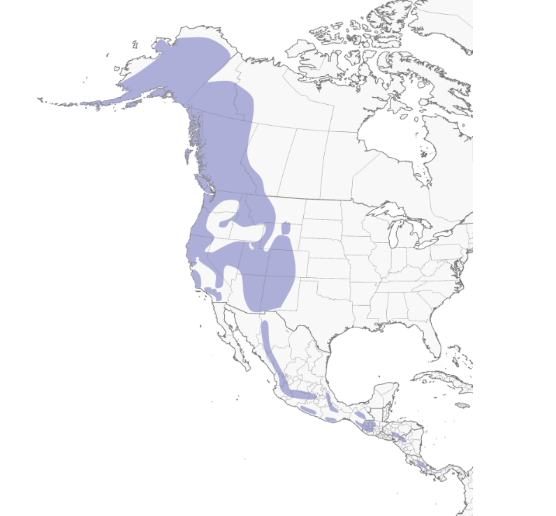
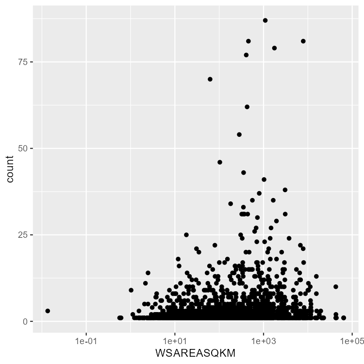
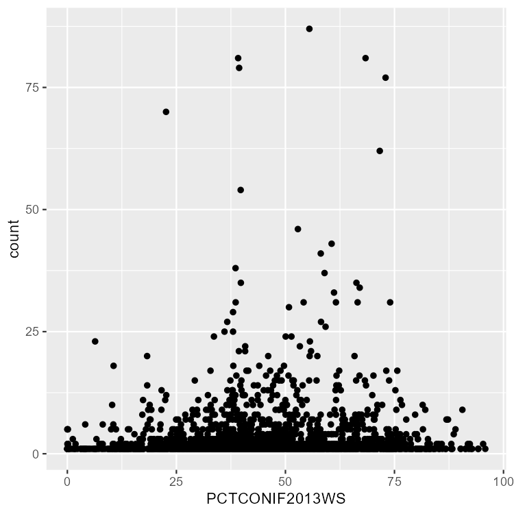
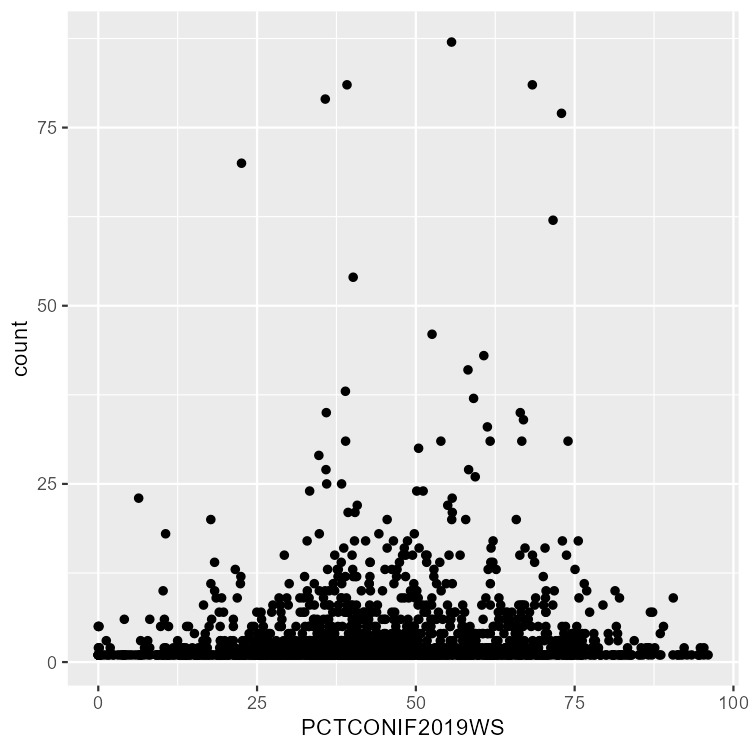
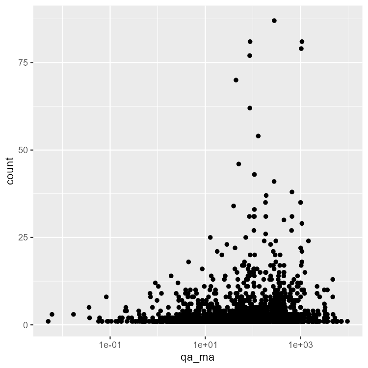
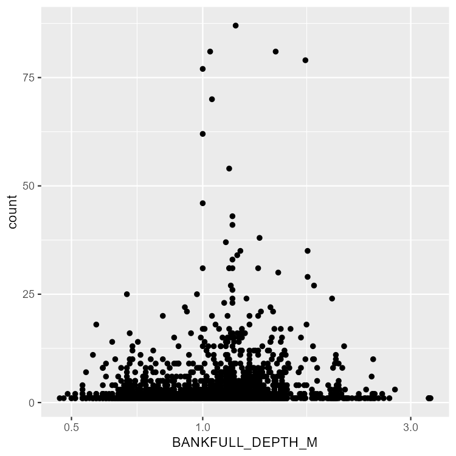
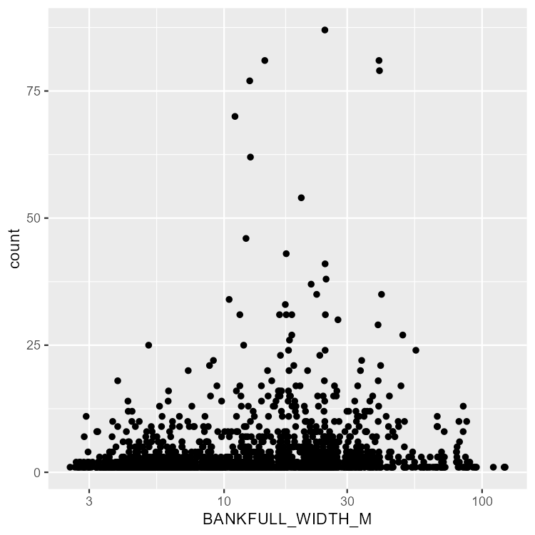

# Results

## Analyzing Dipper Observations

From the crawl function and years assigned from 2013 - 2023 there were 7408 human observations of Dippers. While the crawl function called for data in 2023, GBIF did not provide data for that year. The majority of observations in the study time frame peaked in 2013 with variability in observations from year to year. The lowest number of observations was in 2022 with only 12 total observations. There is no explanation for why the amount of observations dropped off significantly for this year.

```{r, include = F}
source('setup.R')

dipperobswvariables <- readRDS("data/dipperobswvariables.RDS")
dippdf<- dipperobswvariables %>% 
  group_by(COMID) %>%
  summarize(count = n()) %>%
  left_join(dipperobswvariables %>%
              distinct(COMID,.keep_all = T)) %>% 
  select(year, count, slope, qa_ma, WSAREASQKM, BANKFULL_DEPTH_M, BANKFULL_WIDTH_M, BFICAT, BFIWS, RUNOFFWS, THALWEG_DEPTH_CM,PCTCONIF2013WS, PCTCONIF2019WS, season)

```

```{r}
yearplot<- ggplot(data = dippdf, aes(year ,fill = season))+
  geom_histogram(binwidth=.5)+
  scale_fill_manual(values= c('royalblue3','royalblue4'))+
  scale_x_continuous(breaks = c(2013, 2015, 2017, 2019, 2021))


yearplot
```

The distribution of Dippers follows their expected distribution shown in (Figure 4.1). Their expected range spans from the Northern portion of South America to northern Alaska. Their distribution is skewed to the western portion of North America due to their attraction to high mountain, cold, and fast running streams (Watzin & MacIntosh 1999, Feck & Hall 2004, Sullivan & Vierling 2012, Kingery & Wilson 2020).

```{r, fig.cap= "American Dipper Range from Alaska to South America. In Colorado, Dipper Range consists of high elevations on the western portion of the state boundary (Kingery & Wilson 2020)"}

```

In Colorado, observations were on the western portion of the state. The higher elevation and runoff fed streams provide suitable in their range (Kingery & Wilson 2020). Our NHD function provide 63,108 distinct linear features in Colorado. Of those 63,000 features, 2154 unique COMID's were associated with a dipper observation, meaning 3 percent the streams in Colorado had a Dipper sighting between 2013 and 2022.

```{r, include = FALSE}
source("setup.R")
library(kableExtra)
tmap_mode("view")

#load in all your vector data
spatdipvar <- readRDS("data/spatialdipperobswvar.RDS")
co_flowines <- readRDS("data/coflowlines.RDS")

#read in the elevation and landcover rasters
landcover <- terra::rast("data/NLCD_CO.tif")
elevation <- terra::rast("data/elevation.tif")
tmap_mode("view")


states <- tigris::states()
co <- states %>% 
  filter(NAME == 'Colorado')

counties <- tigris::counties(state= "CO")
```

#### Interactive Map of Dipper Observations in Colorado

```{r}
filterflow <- co_flowines %>% 
  filter(grepl('River', gnis_name))

tm_shape(co) +
  tm_polygons() +
tm_shape(filterflow)+
  tm_lines(col = "midnightblue",
           lty= 'solid')+
  tm_shape(spatdipvar) +
  tm_symbols(col = "Species",
             palette= "cividis",
             n = 1,
             alpha = 0.8,
             size = 0.5) +
  tm_layout(frame = FALSE,
            legend.outside = TRUE,
            legend.outside.position = "right")
```

The average distance from the observation to the flow line was 126.88 meters. While Dipper observations are usually associated with a water feature, citizen science applications prompt the user to associate the sighting with a hot spot nearby instead of attaching a geographic location to each sighting (GBIF Secretariat 2022). When filtering observations for unique COMID's, the amount of observations that were found at a unique flow line are 2154 observations.

## Stream Characteristics: Watershed

Within Colorado, Dippers occupy diverse watersheds. The average watershed area that dippers were found to occupy is 1335 square kilometers, with the majority of observations occurring in watersheds that are 1000 square kilometers (Figure 4.2)

```{r, fig.cap= " Observations of Dippers plotted over the Watershed Area (SQKM) on a log scale to aquire a normal distribution. The majority of Dipper observations fall within watershed that are 1000 sqaure kilometers."}

```

Runoff and base flow index at the watershed level were also analyzed. The average base flow percent for streams was 65%. From this information, we can conclude that from the base flow index, Dipper prefer perennial streams. This observation aligns with Kingery & Wilson (2022) who describe Dipper habitat to be pertinent to flowing water year round.

Forests are a dominate land cover type in Colorado and categorized as 30% of the states land cover type. Within the watersheds examined, the average conifer forest land classification in 2013 was 44.36 percent with a standard deviation of 18.86. In 2019, the percentage was slightly less at 44.28% with a standard deviation of 18.78. The distribution of dipper observation to land cover shows the majority of Dipper observations are found within watersheds with conifer forests dominating around 50% (Figure 4.3). In Idaho, Dipper observations were found to be in watersheds that are heavily dominate to evergreen forests (Sullivan & Vierling 2012) which could show that Dipper presence could be more dependent on stream characteristics rather than land cover (Kingery & Wilson 2020).

```{r, fig.cap= "A comparison of dipper observations plotted over the percent of landcover labeled as Conifer forest. From 2013 to 2019 the average percent of Conifer forests did not differ greatly. The distribution in these plots show that the majority of dipper observations are found where Land Cover types are around 50% conifer within the Watershed"}


```

## Stream Characteristics: Stream

Individual streams where Dipper's were observed varied in discharge, depth, and width. Using the NHD data, mean annual stream flow for the streams attached to observations averaged 312.243 with the minimum flow at 0.005 and the max at 9679.02 and a standard deviation of 753.87 cubic feet per second. (Figure 4.4) The result of this analysis suggest that Dippers occupy a wide variety of streams in relation to discharge.

```{r, fig.cap = "Dipper observations are plotted over Mean annual stream flow in log scale. The distribution of Dipper observations show that observations occur where stream flow is around 300 cfs."}

```

Slope presumed to be one of the more important factors for Dipper presence. Dipper often choose fast moving streams during breeding season but noted to occupy flat, wide streams during non breeding seasons (Kingery & Wilson 2020). Based on the exploration of our data, the average slope during the breeding season was 1.77% and during non breeding was 3.99%. This suggests that during the non breeding season there would be faster moving streams that are preferred. While this data may suggest different from the literature, slope was not analyzed at the exact point of the observation, rather than an average slope over the entire course of the water feature.

```{r}
dipslope <- dippdf %>% 
  group_by(season) %>% 
  summarise(mean(slope))

kbl(dipslope, format= "html", caption= "Mean Slope of water feature attached to an observation during breeding and non breeding season (%)", centering = T)
```

Thalweg depth models also demonstrate the vareity of streams occupied by Dippers. the average depth modeled was 52 cm with the minimum thalweg depth at 12 cm and the max 232.41 cm. The standard deviation between these calculation is 30.59.

In the analysis with citizen science data bankfull depth models were validated by a focus study. Our result show the average bankfull depth being 1.088 meters with a range from 0.470-3.330 meters. The standard deviation of depth being 0.39 meters. The results that were generated by a random forest model were validated by Sullivan & Vierling 2012, where the findings on a focus site in Idaho were similar with average depth found in the study were 1.1 m with a standard deviation of 0.4. These results also confirm the priority of stream depth priority during breeding season to be less than two meters deep (Kingery & Wilson 2020)

```{r}
dipseasondepth <- dippdf %>% 
  group_by(season) %>% 
  summarise(mean(BANKFULL_DEPTH_M))
dipseasondepth
```

```{r, fig.cap = "Dipper observations are plotted over Bankfull Depth (m) in log scale. The distribution of Dipper observations show that Dippers prefer a shallow stream. The findings from this analysis are validated by Sullivan & Vierlings focal study in Idaho where the average depth was found to be similar to the modeled depth that is provided by the stream Cat database"}

```

Additionally, the variation of bankfull width when compared to the same study suggests that stream characteristics can vary in width, by depth may be higher priority for Dipper presence. Our analysis show that the mean bankfull width of streams in Colorado is 17.6 m with a range of 2.5 to 122.8 m and a standard deviation of 16.63. Sullivan & Vierling 2012 had a smaller range of bankfull width, 5.7-31.5 m with an average width of 14.8 m and a standard deviation of 6.9. This finding shows there is no similarity in stream width preference and an opportunity to explore how stream width is distributed geographically.

This finding however shows that our results exceed the claim in which stream width during breeding season rarely exceeds 15 meters (Kingery & Wilson 2020) where our results find an average width of 21 meters at bankfull. An issue with this finding is that bankfull does not mean the stream is at this width.

```{r, fig.cap = "Dipper observations are plotted over Bankfull Width (m) in log scale. The distribution of Dipper observations show that Dippers have no preference in stream width when compared to Sullican and vierlings (2012) analysis of environmental characteristics. This suggests that because bankfull width may vary geographically, Dipper presence may not depend on this characteristic."}

```

```{r}
dipseasonwidth <- dippdf %>% 
  group_by(season) %>% 
  summarise(mean(BANKFULL_WIDTH_M))
dipseasonwidth
```
